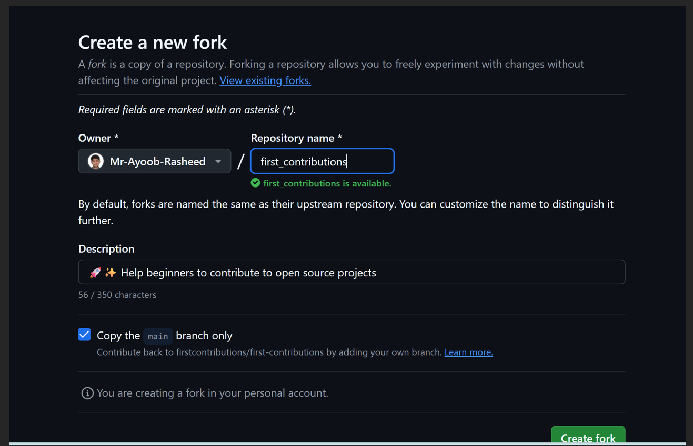
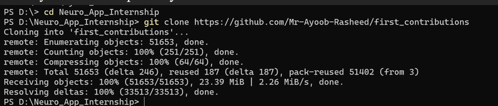
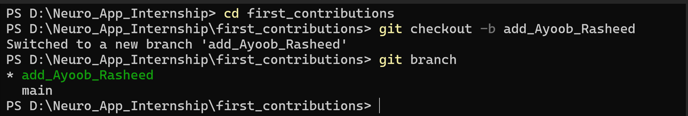
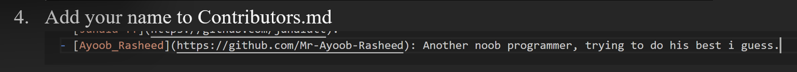
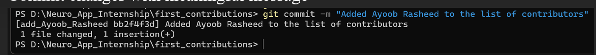
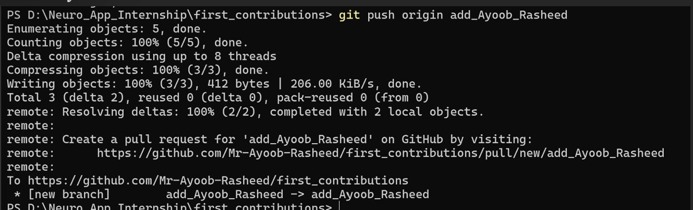
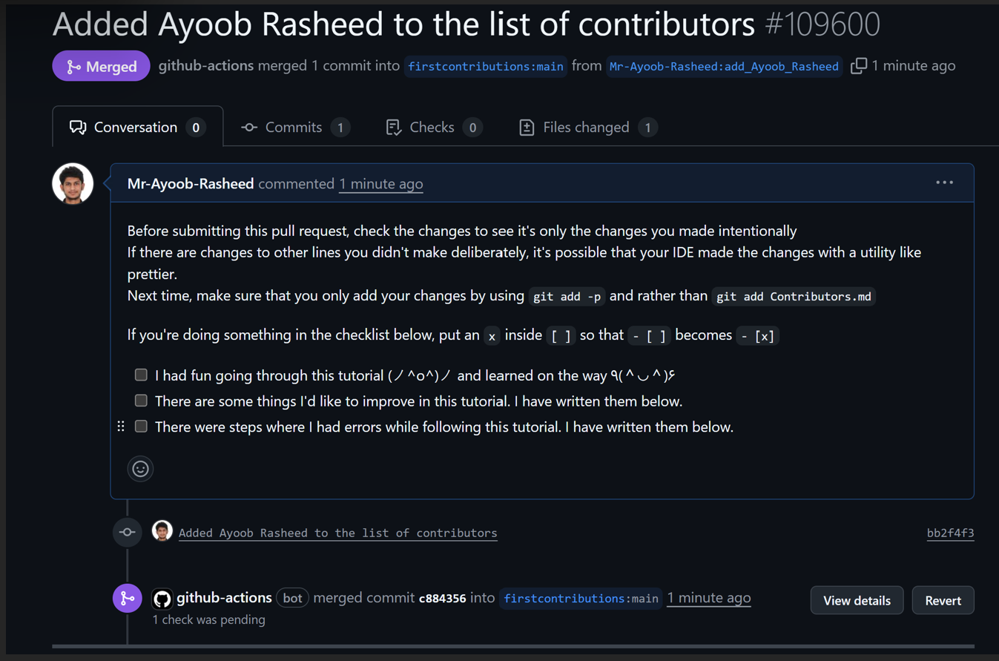

# flutter_internship_B01_W_2
Week 2 repository according to a flutter and dart internship at Neuro App

Ayoob Rasheed
Batch Number 01
Internship Start Date: December 18th, 2025

This repository contains my learning and tasks during the Flutter internship.

## Open Source Contribution – First Contributions

### Steps Followed:

1. Forked the repository
2. Cloned the fork locally
3. Created a new branch
4. Added my name to Contributors.md
5. Committed and pushed changes
6. Created a Pull Request

### Screenshots:

#### Forked Repository

#### Clone Repository

#### Branch Creation

#### Added Name

#### Commit

#### push

#### Pull Request

